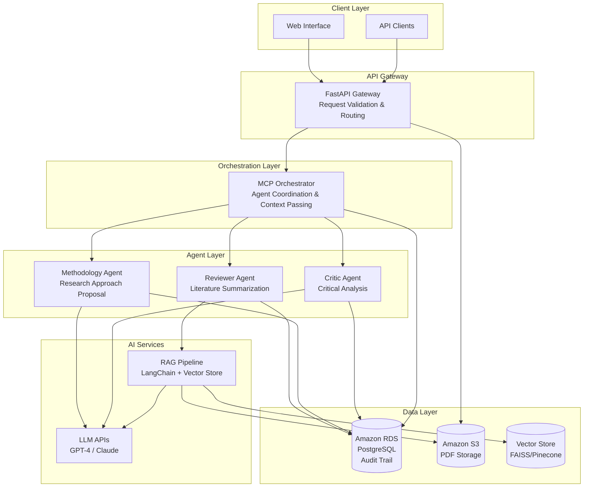

# Design Document: AI Research Co-Author

## Overview

The AI Research Co-Author is a multi-agent GenAI system that assists researchers in creating explainable, citation-grounded, early-stage research drafts. Unlike existing tools that suffer from hallucinations and non-transparent reasoning, this system employs a structured multi-agent architecture with specialized roles, RAG-powered citation grounding, and complete traceability through audit trails.

### Core Design Principles

1. **Separation of Concerns**: Clear distinction between orchestration (MCP) and content generation (agents)
2. **Explainability First**: Complete audit trail of all agent outputs, reasoning, and draft versions
3. **Citation Grounding**: Zero hallucinated references through RAG-based retrieval
4. **Modularity**: Each agent operates independently with well-defined interfaces
5. **Resilience**: Graceful error handling with retry logic and meaningful feedback
6. **Transparency**: Content-neutral orchestration that doesn't influence agent outputs

### Technology Stack

- **Backend**: Python-based microservices architecture with FastAPI
- **Orchestration**: Custom MCP (Manager/Controller Process) for agent coordination
- **Agent Framework**: LangChain for RAG pipelines, prompt templating, and output parsing (within agents only)
- **LLM Integration**: OpenAI GPT-4 or Anthropic Claude APIs
- **Data Storage**: Amazon RDS PostgreSQL for structured data and audit trails
- **Document Storage**: Amazon S3 for PDF documents
- **Vector Store**: FAISS or Pinecone for RAG similarity search
- **Infrastructure**: AWS (EC2, RDS, S3, CloudWatch)
- **API Framework**: FastAPI with Pydantic for validation


## Architecture

### High-Level Architecture




### Component Responsibilities

**FastAPI Gateway**:
- Validates incoming API requests
- Routes requests to MCP orchestrator
- Handles file uploads (PDFs) to S3
- Returns draft generation status and results
- Implements rate limiting and authentication (post-MVP)

**MCP Orchestrator**:
- Coordinates agent execution in sequence: Reviewer → Methodology → Critic
- Passes context between agents without modifying content
- Aggregates agent outputs into final research draft
- Handles agent failures and implements retry logic
- Logs orchestration flow to audit trail
- Content-neutral: does NOT generate or modify research content

**Reviewer Agent**:
- Retrieves relevant literature using RAG pipeline
- Summarizes existing research with citation grounding
- Identifies key themes, trends, and research gaps
- Generates Related Work section
- Uses LangChain for document loading and vector search

**Methodology Agent**:
- Proposes research methodologies based on prior work
- Grounds proposals in citations from literature
- Explains methodology appropriateness and key steps
- Generates Methodology section
- Uses LangChain for prompt templating

**Critic Agent**:
- Identifies weaknesses, assumptions, and limitations
- Analyzes threats to validity
- Provides constructive improvement suggestions
- Generates Limitations section
- Uses LangChain for output parsing

**RAG Pipeline**:
- Embeds and indexes PDF documents in vector store
- Performs similarity search for relevant passages
- Retrieves source documents with metadata
- Ensures all citations are traceable to source documents


## Components and Interfaces

### MCP Orchestrator Component

**Purpose**: Coordinate agent execution and context passing without generating content.

**Interfaces**:

```python
class MCPOrchestrator:
    def generate_research_draft(
        self,
        request_id: str,
        research_topic: str,
        seed_documents: List[str]
    ) -> ResearchDraft:
        """
        Orchestrate multi-agent research draft generation.
        
        Args:
            request_id: Unique identifier for the request
            research_topic: User-provided research topic
            seed_documents: List of S3 keys for seed PDF documents
            
        Returns:
            ResearchDraft with all sections and audit trail
        """
        pass
    
    def execute_agent_sequence(
        self,
        request_id: str,
        context: Dict[str, Any]
    ) -> Dict[str, AgentOutput]:
        """
        Execute agents in sequence: Reviewer → Methodology → Critic.
        
        Args:
            request_id: Unique identifier for tracking
            context: Initial context including topic and documents
            
        Returns:
            Dictionary mapping agent names to their outputs
        """
        pass
    
    def handle_agent_failure(
        self,
        agent_name: str,
        error: Exception,
        retry_count: int
    ) -> AgentOutput:
        """
        Handle agent execution failures with retry logic.
        
        Args:
            agent_name: Name of the failed agent
            error: Exception that occurred
            retry_count: Current retry attempt number
            
        Returns:
            AgentOutput (may be partial or error state)
        """
        pass
```

